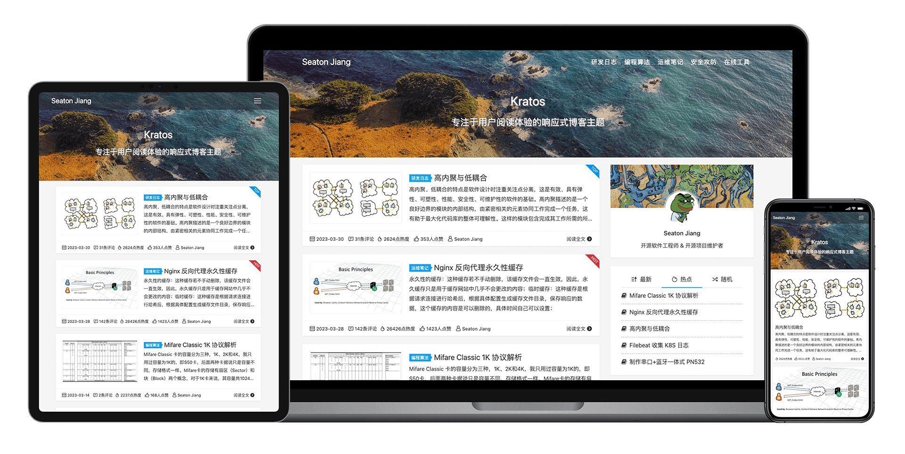

English | [简体中文](README.zh-CN.md)

    

    
    
    
    
    

    <a href="https://github.com/seatonjiang/kratos/issues">Report Bug</a>
    ·
    <a href="https://github.com/seatonjiang/kratos/issues">Request Feature</a>

WordPress theme that focus on reading experience

## 🚀 Quick start

1. First download the theme's .zip file from the source file to your local computer.

2. From your WordPress Administration area, head to Appearance > Themes and click `Add New`.

3. The Add New theme screen has a new option, `Upload Theme`.

4. The theme upload form is now open, click `Choose File`, select the theme zip file on your computer and click `Install Now`.

5. The theme can now be activated from the administrator. Select the `Appearance` tab, then open the theme catalog, find the theme, and click the `Activate link`.

## 🤝 Contributing

We welcome all contributions. You can submit any ideas as pull requests or as issues, have a good time! :)

## 📃 License

The project is released under the GNU General Public License v3.0, see the [LICENCE](https://github.com/seatonjiang/kratos/blob/main/LICENSE) file for details.
